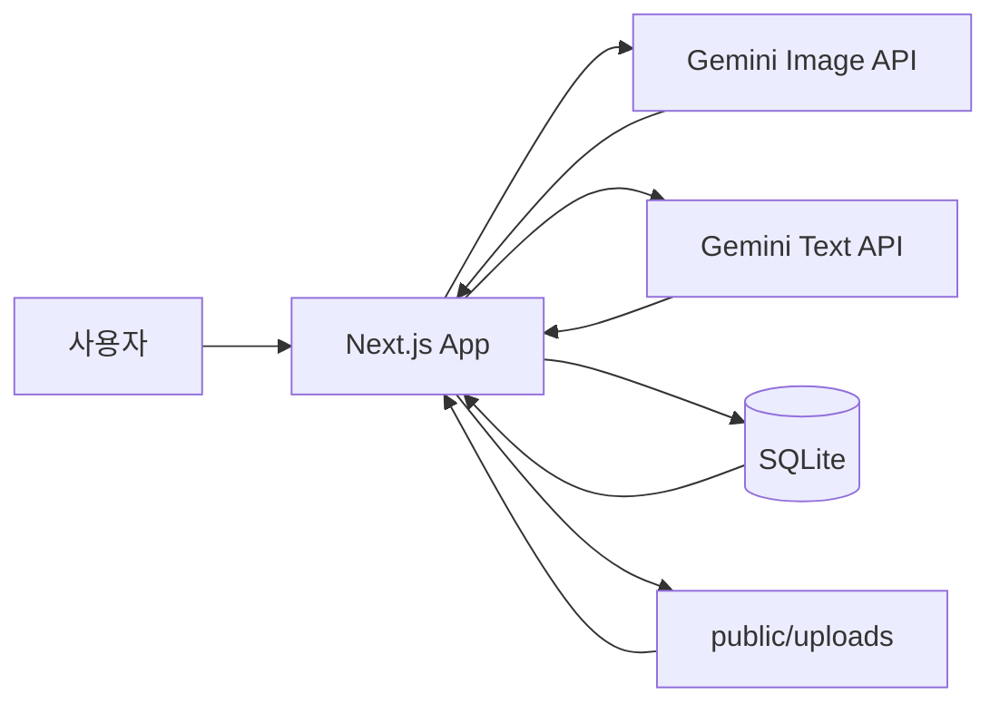

# AI 옷입히기

## .env.local 설정

프로젝트 루트에 `.env.local` 파일을 만들고 아래 값을 설정합니다.

```bash
GEMINI_API_KEY=your_gemini_text_api_key
GEMINI_IMAGE_API_KEY=your_gemini_image_api_key
GEMINI_TEXT_MODEL=gemini-2.0-flash
GEMINI_IMAGE_MODEL=gemini-2.5-flash-image
```

- `GEMINI_API_KEY`: 엄마 AI 평가 텍스트 생성에 사용합니다.
- `GEMINI_IMAGE_API_KEY`: 모자, 상의, 하의 이미지 생성에 사용합니다.
- 두 API 키를 같은 Gemini 키로 써도 됩니다.
- `GEMINI_IMAGE_API_KEY`가 없으면 이미지 생성은 mock 이미지로 동작합니다.

## 의존성 버전

| 패키지 | 버전 |
| --- | --- |
| Next.js | `15.3.2` |
| React | `19.1.0` |
| React DOM | `19.1.0` |
| better-sqlite3 | `^11.7.0` |
| sharp | `^0.34.1` |

## 서비스 아키텍처


